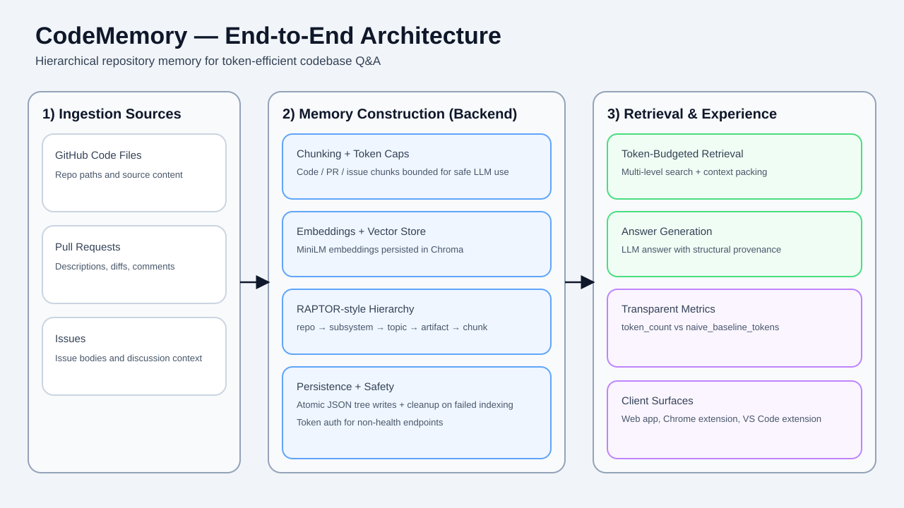

# CodeMemory


**CodeMemory is a hierarchical memory layer for GitHub repositories.**  
It indexes code, pull requests, and issues once, then answers natural-language questions with a token-budgeted retrieval pipeline instead of brute-force context dumping.



---

## What this project is

CodeMemory is a full-stack system with:

- **Backend (FastAPI)** for indexing, retrieval, and query answering
- **Web app (React)** for indexing repos, exploring the tree, and querying
- **Chrome extension** for quick contextual questions from any web page
- **VS Code extension** for in-editor repository memory access

It combines:

- **Chunking** of code/PR/issue data
- **Embeddings** (MiniLM + Chroma)
- **RAPTOR-style hierarchy** (repo → subsystem → topic → artifact → chunk)
- **Token-aware packing** for LLM prompts
- **Transparent token accounting** (`token_count` vs `naive_baseline_tokens`)

---

## Why it exists

Modern repositories are too large to send directly to an LLM for every question.  
Without a memory layer, teams pay in:

- high token cost
- slower response times
- noisy, low-signal context
- repeated re-reading of the same history

CodeMemory exists to make repository Q&A:

- **cheaper** (less context sent)
- **faster** (pre-built semantic memory)
- **more explainable** (shows node paths used for answers)
- **better for evolution questions** ("why did this change?" across PR/issue/code history)

---

## Advantages vs similar tools (including Supermemory-style approaches)

> This comparison describes **CodeMemory’s design choices** and common trade-offs in general-purpose memory tools.

| Area | CodeMemory | Typical generic memory tools / Supermemory-style setups |
|---|---|---|
| Primary unit of memory | **Repository-native hierarchy** (subsystems/topics/artifacts/chunks) | Often document/snippet-centric memory |
| Data sources | **Code + PR diffs/comments + issues/comments** | Frequently text-first; repo-history depth varies by integration |
| Token transparency | Returns **actual packed tokens + naive baseline + savings** | Usually less explicit token economics per answer |
| Explainability | Returns **exact node paths** used for retrieval | Provenance may be less structural |
| Deployment model | Can be run in your own stack with local persistence choices | Often SaaS-first managed memory |
| Query objective | Optimized for **code evolution and design reasoning** | Often broad personal/team knowledge retrieval |
| UX surfaces | Web app + Chrome + VS Code in this repo | Tooling varies by vendor and plan |

If your main workload is repository understanding, PR archaeology, and architecture evolution, CodeMemory is intentionally specialized for that workflow.

---

## How it works (high level)

1. **Ingest** repository data from GitHub APIs (files, PRs, issues).
2. **Chunk** each source into token-capped units.
3. **Embed** chunks and store vectors in Chroma.
4. **Build hierarchy** with clustering + LLM summarization.
5. **Persist tree** as JSON and summary embeddings in the same vector store.
6. **Retrieve** relevant nodes across hierarchy levels for a query.
7. **Pack by token budget** and generate an answer with cited paths.
8. **Report savings** versus a naive baseline context strategy.

---

## Key API endpoints

All routes are under `/api`:

- `GET /health` — service health (no auth)
- `POST /index` — start background indexing
- `GET /index/status` — current indexing state/progress
- `GET /tree` — fetch persisted tree for a repo
- `POST /query` — token-budgeted retrieval + answer generation
- `GET /downloads/chrome` — Chrome extension package
- `GET /downloads/vscode` — VS Code extension package

---

## Repository structure

```text
backend/            FastAPI, chunking, tree building, retrieval, storage
frontend/           React web app for indexing/querying/tree exploration
extensions/chrome/  Chrome MV3 extension
extensions/vscode/  VS Code extension
mobile/             Mobile client workspace
memory/             PRD, stress report, and docs assets
```

---

## Local development (quick start)

### 1) Backend

```bash
cd backend
python -m venv .venv && source .venv/bin/activate
pip install -r requirements.txt
export CODEMEMORY_API_TOKEN=your_token_here
uvicorn server:app --reload --host 0.0.0.0 --port 8000
```

### 2) Frontend

```bash
cd frontend
yarn install
REACT_APP_BACKEND_URL=http://localhost:8000 yarn start
```

### 3) Tests (backend)

```bash
cd backend
pytest
```

---

## Security and operational notes

- Non-health backend routes require a bearer token (`CODEMEMORY_API_TOKEN`).
- CORS supports the configured frontend origin plus Chrome extension origins.
- Tree JSON writes are atomic, and failed indexing runs clean up partial vector collections.
- VS Code extension stores API token in SecretStorage (not plaintext settings).

---

## Current status

The repository includes completed backend/web/extension flows and stress-test artifacts in `memory/stress_report.md`.  
Roadmap/backlog ideas are tracked in `memory/PRD.md`.

---

## Who should use CodeMemory

CodeMemory is best for:

- maintainers onboarding contributors
- teams reviewing architectural change over time
- AI-assisted development workflows that need context efficiency and traceability

If you need memory focused specifically on repository evolution rather than broad personal knowledge capture, this project is built for that use case.
